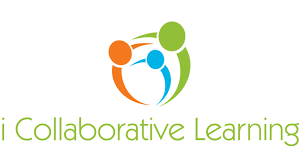

## Milestone 2: Definition & Related Work
In this milestone, we will clearly define the computing-related task / problem, identify existing solutions to that or similar tasks / problems,
propose a potential solution, and summarize that work in a recorded video presentation.

### Introduction
Collaborative learning is a situation in which two or more people learn or attempt to learn something together.
Unlike individual learning, people engaged in collaborative learning

capitalize on one another's resources and skills. More specifically, collaborative learning is based on the model that knowledge can be created
within a population where members actively interact by sharing experiences and taking on asymmetric roles. Thus, collaborative learning is commonly 
illustrated when groups of students work together or students and their teacher work together to search for understanding, meaning, or solutions or
to create an artifact or product of their learning or even write a code. Collaborative learning activities can include collaborative writing, group
projects, joint problem solving, debates, study teams, and other activities. The approach is closely related to cooperative learning. 

The main purpose of a live-coding session is to teach programming as a process. This approach helps students to fully understand the tasks and
techniques that are needed to write a fully working program, after going through multiple iterations of thinking, designing, coding, and testing.
Therefore, collaborative learning can strongly affect student participation, performance, or engagement. This is not limited to students;
instructors are affected by this issue too. Because teaching performance has always been very important to instructors. 

Speaking of the importance of live coding research shows that live coding:
1. Makes the process of programming easy to understand for novice programmers.
2. Helps students learn the process of [debugging](www.google.com).
3. Exposes students to good programming practices.
4. Students prefer to code along with the instructor during a live-coding session rather than being mere observers.
 
Hence this is something that not only is important in online courses but also in in-person and thus hybrid classes. 

Live coding for the sake of cooperative learning without proper collaboration can lead to code cramming without understanding.
Collaborative writing without history and log maintenance can cause a lack of transparency and poor engagement of collaborators.

### Logo

